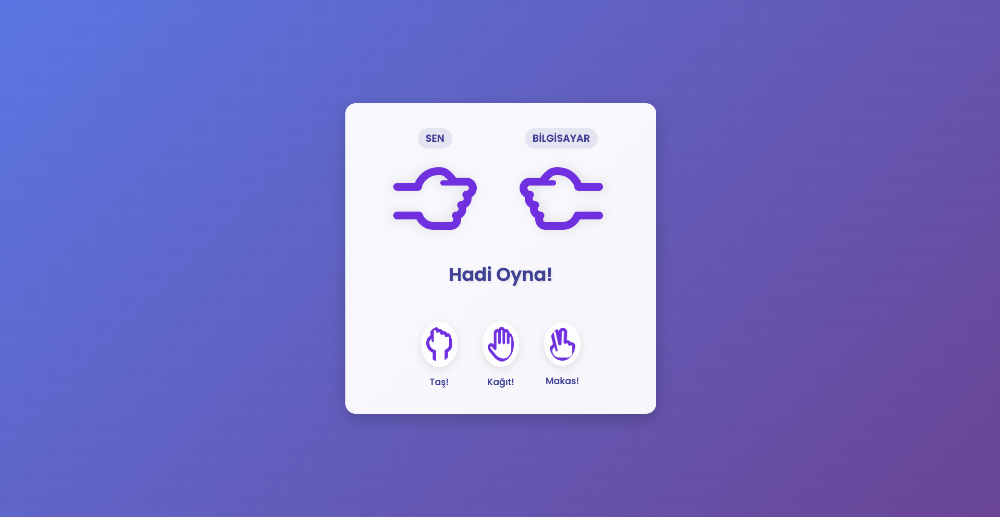

# Rock Paper Scissors Game

An interactive web-based version of the classic Rock Paper Scissors game. A simple and fun game you can play against the computer.



## Features

- User-friendly interface
- Rock, paper, and scissors options
- Real-time game results
- Impressive animations
- Fully responsive design

## Technologies

- HTML5
- CSS3
- JavaScript

## How to Play

1. Click on one of the rock, paper, or scissors options
2. The computer will automatically make its choice
3. The winner will be displayed on the screen

## Game Rules

- Rock beats scissors
- Paper beats rock
- Scissors beats paper
- Same choices result in a tie

## Installation

To run the project locally:

1. Clone this repository
   ```
   git clone https://github.com/Alitpz/RockPaperScissors-Game-.git
   ```
2. Navigate to the downloaded folder
3. Open the `index.html` file in a web browser


